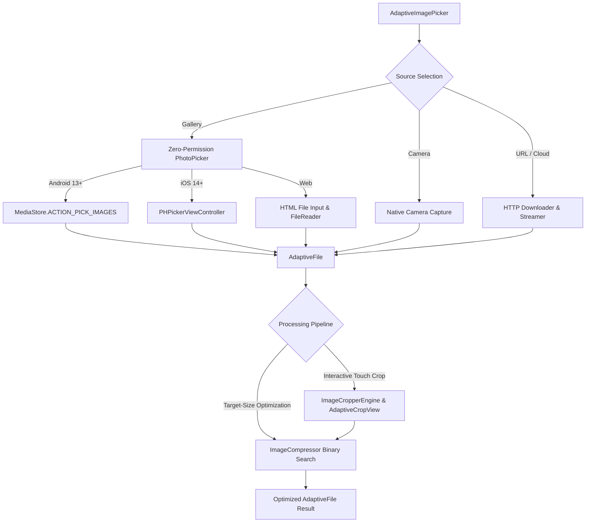

# adaptive_image_picker

<p align="center">
  <a href="https://pub.dev/packages/adaptive_image_picker"></a>
  <a href="https://pub.dev/packages/adaptive_image_picker/score"></a>
  <a href="https://pub.dev/packages/adaptive_image_picker"></a>
  <a href="https://opensource.org/licenses/MIT"></a>
</p>

<p align="center">
  <b>The modern, zero-permission, all-in-one Flutter media picker.</b><br>
  Built from scratch with native Android 13+ Photo Picker, iOS 14+ <code>PHPicker</code>, pure-Dart interactive gesture cropper with circular avatar masks, binary-search target-size compressor, and adaptive modal sheets.
</p>

---

## 📑 Table of Contents

- [Why Choose `adaptive_image_picker`?](#-why-choose-adaptive_image_picker)
- [Key Features](#-key-features)
- [Zero-Permission Architecture](#-zero-permission-architecture)
- [Quick Start](#-quick-start)
- [Platform Setup](#-platform-setup)
  - [iOS Setup](#ios-setup)
  - [Android Setup](#android-setup)
  - [Web Setup](#web-setup)
- [Comprehensive Recipes & Code Examples](#-comprehensive-recipes--code-examples)
  - [1. Launch Adaptive Action Sheet Modal](#1-launch-adaptive-action-sheet-modal-camera-gallery-url)
  - [2. Pick Single Image with Aspect Ratio Crop & Compression](#2-pick-single-image-with-aspect-ratio-crop--compression)
  - [3. Profile Avatar Flow (Circle Mask + WebP Target Size)](#3-profile-avatar-flow-circle-mask--webp-target-size)
  - [4. Multi-Image Selection with Batch Compression](#4-multi-image-selection-with-batch-compression)
  - [5. Standalone Interactive Cropper View](#5-standalone-interactive-cropper-view)
  - [6. Strict Target-Size Compressor (Binary Search)](#6-strict-target-size-compressor-binary-search)
  - [7. Import Image from Remote URL & Transform](#7-import-image-from-remote-url--transform)
  - [8. Save to Local App Storage or Device Gallery (Photos App)](#8-save-to-local-app-storage-or-device-gallery-photos-app)
- [Feature Comparison Matrix](#-feature-comparison-matrix)
- [API Reference](#-api-reference)
- [FAQ & Troubleshooting](#-faq--troubleshooting)
- [License](#-license)

---

## 💡 Why Choose `adaptive_image_picker`?

Traditional Flutter image pickers rely on legacy Android storage permissions (`READ_EXTERNAL_STORAGE` / `READ_MEDIA_IMAGES`) and outdated iOS library permissions (`NSPhotoLibraryUsageDescription`), leading to Play Store review rejections, privacy warnings, and inconsistent native cropper dependencies.

`adaptive_image_picker` solves this completely:
1. **Zero Permissions for Gallery**: Uses **Android 13+ Photo Picker** (`MediaStore.ACTION_PICK_IMAGES`, backported to Android 4.4 via Google Play Services) and **iOS 14+ `PHPickerViewController`**. No privacy declarations needed.
2. **Pure-Dart Interactive Cropping**: Pinch-to-zoom, pan, rule-of-thirds grid, circle masks, 90° rotation, and flips with **zero native C++/Gradle/CocoaPods dependencies**.
3. **Guaranteed Byte Size Limits**: Enforces strict payload limits (e.g. `< 200 KB` or `< 1.5 MB`) via an intelligent binary search compression and downscaling algorithm.
4. **All Platforms Supported**: Seamless, unified Dart API across Android, iOS, Web, macOS, Windows, and Linux.

---

## ✨ Key Features

- 🔒 **Zero-Permission Gallery**: Native out-of-process photo selection requiring zero runtime storage permissions.
- 📸 **Camera Integration**: Automated `FileProvider` on Android and `UIImagePickerController` on iOS.
- ✂️ **Pure-Dart Interactive Cropper**:
  - Touch gesture pinch, zoom, pan, and handle dragging.
  - Circular avatar masking with antialiased alpha transparency.
  - Preset aspect ratios: `1:1`, `16:9`, `4:3`, `3:2`, `9:16`, `Original`, `Freeform`, and `Custom`.
  - 90° clockwise rotation and horizontal/vertical flipping.
  - Rule-of-thirds alignment grid.
- 🗜️ **Smart Target-Size Compressor**:
  - Binary search convergence guaranteeing file size strictly $\le$ `maxBytes`.
  - Format conversions: WebP, JPEG, PNG, or preserve original format.
  - Automatic EXIF orientation normalization.
- 🌐 **Remote Image Downloader**: Import and transform images directly from URLs (e.g. Unsplash, CDN, cloud).
- 📱 **Adaptive UI Design**: Cupertino Action Sheets on iOS, Material 3 Bottom Sheets on Android, and responsive modal dialogs on Web/Desktop.

---

## 🏛️ Zero-Permission Architecture



---

## 🚀 Quick Start

### Installation

Add `adaptive_image_picker` to your `pubspec.yaml`:

```yaml
dependencies:
  adaptive_image_picker: ^1.0.0
```

Or install via terminal:

```bash
flutter pub add adaptive_image_picker
```

### Basic Example (One-Liner)

```dart
import 'package:flutter/material.dart';
import 'package:adaptive_image_picker/adaptive_image_picker.dart';

// Pick an image from gallery with zero permissions
final AdaptiveFile? file = await AdaptiveImagePicker.pickImage();

if (file != null) {
  print('Picked ${file.name} (${file.formattedSize})');
}
```

---

## ⚙️ Platform Setup

### iOS Setup

- **Gallery Selection**: Zero configuration required! iOS 14+ uses `PHPickerViewController`, which **does not require** `NSPhotoLibraryUsageDescription`.
- **Camera Capture (Optional)**: If you enable `ImageSource.camera`, add the camera description to `ios/Runner/Info.plist`:

```xml
<key>NSCameraUsageDescription</key>
<string>This app requires access to the camera to take profile photos.</string>
```

### Android Setup

- **Gallery Selection**: Zero configuration required! Automatically leverages Android 13+ Photo Picker (`MediaStore.ACTION_PICK_IMAGES`) with backward compatibility to Android 4.4 KitKat via Google Play Services.
- **Camera Capture (Optional)**: `adaptive_image_picker` automatically declares the internal `FileProvider` and `<queries>` block in its plugin manifest. No manual Android manifest modifications required.

### Web Setup

Zero configuration required. Web uses standard HTML `<input type="file">` and `FileReader` APIs via `package:web`.

---

## 📖 Comprehensive Recipes & Code Examples

### 1. Launch Adaptive Action Sheet Modal (Camera, Gallery, URL)

Presents an OS-adaptive modal bottom sheet (Cupertino on iOS, Material 3 on Android):

```dart
final AdaptiveFile? file = await AdaptiveImagePicker.showPickerModal(
  context: context,
  options: const PickerOptions(
    modalTitle: 'Select Photo Source',
    sources: [ImageSource.camera, ImageSource.gallery, ImageSource.url],
  ),
  cropOptions: const CropOptions(title: 'Crop Photo'),
  compressionOptions: CompressionOptions.webOptimized(
    maxBytes: 500 * 1024, // <= 500 KB
  ),
);
```

---

### 2. Pick Single Image with Aspect Ratio Crop & Compression

```dart
final AdaptiveFile? file = await AdaptiveImagePicker.pickImage(
  source: ImageSource.gallery,
  context: context,
  cropOptions: const CropOptions(
    title: '16:9 Banner Crop',
    aspectRatioPreset: CropAspectRatio.ratio16x9,
    lockAspectRatio: true,
    showGrid: true,
  ),
  compressionOptions: const CompressionOptions(
    maxBytes: 350 * 1024, // Compresses strictly under 350 KB
    format: OutputFormat.webp,
  ),
);
```

---

### 3. Profile Avatar Flow (Circle Mask + WebP Target Size)

Picks an image, locks circular avatar crop with antialiased alpha transparency, and downscales to under 100 KB:

```dart
final AdaptiveFile? avatar = await AdaptiveImagePicker.pickImage(
  source: ImageSource.gallery,
  context: context,
  cropOptions: CropOptions.circle(
    title: 'Set Profile Avatar',
  ),
  compressionOptions: CompressionOptions.avatar(
    maxBytes: 100 * 1024, // Strictly <= 100 KB
  ),
);
```

---

### 4. Multi-Image Selection with Batch Compression

Picks multiple photos concurrently and applies batch compression:

```dart
final List<AdaptiveFile> files = await AdaptiveImagePicker.pickMultiple(
  maxCount: 5,
  compressionOptions: const CompressionOptions(
    quality: 85,
    format: OutputFormat.webp,
    maxWidth: 1920,
    maxHeight: 1080,
  ),
);

for (final file in files) {
  print('${file.name}: ${file.formattedSize}');
}
```

---

### 5. Standalone Interactive Cropper View

Open the gesture cropper on any existing `AdaptiveFile`:

```dart
final AdaptiveFile? cropped = await AdaptiveImagePicker.cropImage(
  file: existingFile,
  context: context,
  options: const CropOptions(
    showGrid: true,
    allowRotation: true,
    allowFlipping: true,
    availableAspectRatios: [
      CropAspectRatio.free,
      CropAspectRatio.ratio1x1,
      CropAspectRatio.ratio4x3,
      CropAspectRatio.ratio16x9,
    ],
  ),
);
```

---

### 6. Strict Target-Size Compressor (Binary Search)

Guarantees output file size strictly adheres to the byte limit:

```dart
final AdaptiveFile compressed = await AdaptiveImagePicker.compressImage(
  file: largeFile,
  options: CompressionOptions.targetSize(
    150 * 1024, // Output will strictly be <= 150 KB
    format: OutputFormat.webp,
  ),
);

print('Optimized from ${largeFile.formattedSize} to ${compressed.formattedSize}');
```

---

### 7. Import Image from Remote URL & Transform

Download directly from web/cloud, crop, and compress in one call:

```dart
final AdaptiveFile file = await AdaptiveImagePicker.fromUrl(
  'https://picsum.photos/800/600',
  context: context,
  cropOptions: const CropOptions(
    shape: CropShape.circle,
    aspectRatioPreset: CropAspectRatio.ratio1x1,
  ),
  compressionOptions: const CompressionOptions(
    maxBytes: 200 * 1024,
    format: OutputFormat.webp,
  ),
);
```

---

### 8. Save to Local App Storage or Device Gallery (Photos App)

#### A. Save to App Local Filesystem (Built-in)
```dart
import 'package:path_provider/path_provider.dart';

final dir = await getApplicationDocumentsDirectory();

// Save directly with file.name into directory
final AdaptiveFile savedFile = await file.saveToDirectory(dir.path);
print('Saved at: ${savedFile.path}');
```

#### B. Save to User's Native Device Gallery / Photos App
Pair with the lightweight [`gal`](https://pub.dev/packages/gal) package:

```dart
import 'package:gal/gal.dart';

if (file.path != null) {
  await Gal.putImage(file.path!);
} else {
  final bytes = await file.readAsBytes();
  await Gal.putImageBytes(bytes, name: file.name);
}
```

#### C. Upload to Cloud Backend (Firebase / Supabase / AWS S3)
```dart
final Uint8List bytes = await file.readAsBytes();

// Example HTTP Multipart upload
final request = http.MultipartRequest('POST', Uri.parse('https://your-api.com/upload'))
  ..files.add(http.MultipartFile.fromBytes(
    'file',
    bytes,
    filename: file.name,
    contentType: MediaType.parse(file.mimeType ?? 'image/jpeg'),
  ));
final response = await request.send();
```

---

### 9. Full UI Theming & Custom Modal Builder

You can completely customize the visual appearance of bottom sheets, dialogs, and the cropper interface:

#### A. Custom `PickerTheme`
```dart
final file = await AdaptiveImagePicker.showPickerModal(
  context: context,
  options: PickerOptions(
    modalTitle: 'Choose Profile Image',
    theme: PickerTheme(
      backgroundColor: const Color(0xFF1E1E24),
      tileBackgroundColor: const Color(0xFF2A2A32),
      titleTextStyle: const TextStyle(
        color: Colors.white,
        fontSize: 18,
        fontWeight: FontWeight.bold,
      ),
      cameraIconColor: Colors.deepOrangeAccent,
      galleryIconColor: Colors.tealAccent,
      urlIconColor: Colors.purpleAccent,
      borderRadius: const BorderRadius.vertical(top: Radius.circular(32)),
      tileBorderRadius: BorderRadius.circular(18),
    ),
  ),
  cropOptions: const CropOptions(
    toolbarColor: Color(0xFF1E1E24),
    backgroundColor: Color(0xFF121214),
    activeHandleColor: Colors.deepOrangeAccent,
    gridColor: Colors.white24,
  ),
);
```

#### B. 100% Custom Modal Builder (`customModalBuilder`)
If you want to render your own proprietary UI layout for source selection:

```dart
final file = await AdaptiveImagePicker.showPickerModal(
  context: context,
  options: PickerOptions(
    customModalBuilder: (context, options, onSelectSource) {
      return Container(
        padding: const EdgeInsets.all(24),
        decoration: BoxDecoration(
          color: Theme.of(context).colorScheme.surface,
          borderRadius: const BorderRadius.vertical(top: Radius.circular(32)),
        ),
        child: Row(
          mainAxisAlignment: MainAxisAlignment.spaceEvenly,
          children: [
            IconButton(
              icon: const Icon(Icons.camera_alt_rounded, size: 32),
              onPressed: () => onSelectSource(ImageSource.camera),
            ),
            IconButton(
              icon: const Icon(Icons.photo_library_rounded, size: 32),
              onPressed: () => onSelectSource(ImageSource.gallery),
            ),
            IconButton(
              icon: const Icon(Icons.link_rounded, size: 32),
              onPressed: () => onSelectSource(ImageSource.url),
            ),
          ],
        ),
      );
    },
  ),
);
```

---

## 📊 Feature Comparison Matrix

| Feature | `adaptive_image_picker` | `image_picker` | `image_cropper` | `flutter_image_compress` |
| :--- | :---: | :---: | :---: | :---: |
| **Zero-Permission Gallery (Android 13+ / iOS 14+)** | ✅ Yes | ⚠️ Partial | ❌ N/A | ❌ N/A |
| **Pure-Dart Gesture Cropper** | ✅ Yes | ❌ No | ❌ Native Only | ❌ N/A |
| **Circular Profile Avatar Mask** | ✅ Yes | ❌ No | ⚠️ OS Dependent | ❌ N/A |
| **Strict Target-Size Compression** | ✅ Guaranteed | ❌ No | ❌ No | ❌ No |
| **WebP / JPEG / PNG Conversions** | ✅ Yes | ❌ No | ❌ No | ⚠️ Partial |
| **Adaptive Cupertino/Material Sheet** | ✅ Built-in | ❌ No | ❌ No | ❌ N/A |
| **Direct Remote URL Downloader** | ✅ Built-in | ❌ No | ❌ No | ❌ No |
| **Zero Native Gradle / Pod Conflicts** | ✅ Pure Dart Engine | ⚠️ Complex | ❌ CocoaPod heavy | ❌ Native C++ |

---

## 🛠️ API Reference

### `AdaptiveFile`

| Property / Method | Type | Description |
| :--- | :--- | :--- |
| `name` | `String` | File name with extension (e.g. `"avatar.webp"`). |
| `size` | `int?` | File size in bytes. |
| `formattedSize` | `String` | Human-readable size (`"1.4 MB"`, `"350 KB"`). |
| `width` / `height` | `int?` | Image dimensions in pixels. |
| `aspectRatio` | `double?` | Calculated aspect ratio (`width / height`). |
| `path` | `String?` | Local filesystem path (null on Web/in-memory). |
| `bytes` | `Uint8List?` | In-memory byte buffer (if cached). |
| `readAsBytes()` | `Future<Uint8List>` | Reads file bytes asynchronously. |
| `saveTo(destPath)` | `Future<AdaptiveFile>` | Writes bytes to disk on IO platforms. |
| `saveToDirectory(dir)`| `Future<AdaptiveFile>` | Saves file using its name into a folder. |
| `delete()` | `Future<bool>` | Deletes file from local storage if exists. |

### `CropOptions`

| Property | Type | Default | Description |
| :--- | :--- | :--- | :--- |
| `shape` | `CropShape` | `.rectangle` | `rectangle` or `circle` avatar mask. |
| `aspectRatioPreset` | `CropAspectRatio` | `.free` | Preset ratio (`1:1`, `16:9`, `4:3`, `3:2`, `9:16`, `free`). |
| `lockAspectRatio` | `bool` | `false` | Enforce locked aspect ratio. |
| `showGrid` | `bool` | `true` | Show rule-of-thirds grid overlay. |
| `allowRotation` | `bool` | `true` | Enable 90° clockwise rotation button. |
| `allowFlipping` | `bool` | `true` | Enable horizontal/vertical flip buttons. |

### `CompressionOptions`

| Property | Type | Default | Description |
| :--- | :--- | :--- | :--- |
| `maxBytes` | `int?` | `null` | Exact target byte limit enforced by binary search. |
| `quality` | `int` | `85` | Starting quality factor (1 - 100). |
| `maxWidth` / `maxHeight` | `int?` | `null` | Maximum output pixel dimensions. |
| `format` | `OutputFormat` | `.preserve` | Target format (`webp`, `jpeg`, `png`, `preserve`). |
| `autoOrientation` | `bool` | `true` | Automatically bake EXIF orientation. |

---

## ❓ FAQ & Troubleshooting

#### Q: Why doesn't iOS ask for photo library permissions?
**A:** `adaptive_image_picker` uses `PHPickerViewController` on iOS 14+, which runs out-of-process in a separate system service. The app only receives access to the specific images selected by the user.

#### Q: Why doesn't Android ask for `READ_MEDIA_IMAGES` or `READ_EXTERNAL_STORAGE`?
**A:** Android 13+ introduced the system Photo Picker (`MediaStore.ACTION_PICK_IMAGES`). Google backported this to Android 4.4 via Google Play Services. It grants temporary read access without granting broad storage access.

#### Q: Can I run compression and cropping in background isolates?
**A:** Yes! The pure-Dart engines use Flutter's `compute` isolate runner automatically for intensive operations to keep the UI smooth at 60/120 fps.

---

## 📄 License

This project is licensed under the MIT License - see the [LICENSE](LICENSE) file for details.
